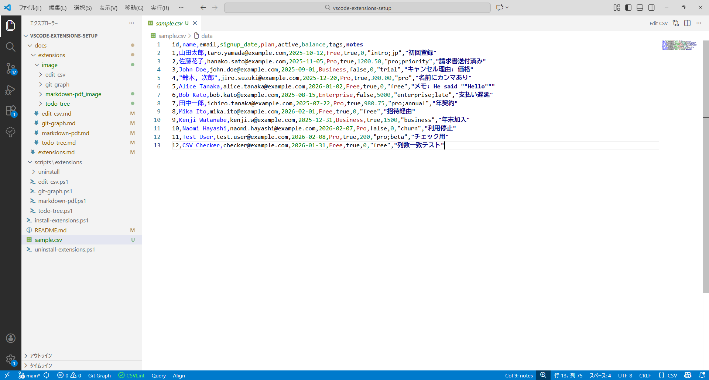
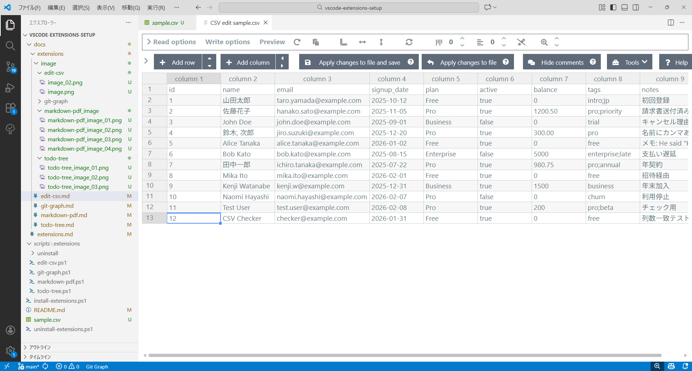

# Edit CSV 使用マニュアル

## 目的
CSV/TSVファイルを表形式のUIで編集し、視覚的に操作しやすくします。

## 解決する課題
- テキスト編集でCSVフォーマットが崩れやすい
- Excel等への依存による差分管理の難しさと往復作業の無駄

## 効率化できること
- VS Code内の表形式UIで安全に編集・並べ替え・フィルタ
- 構造を維持した保存でフォーマット崩れを防止
- 外部ツールへの切り替えを減らし、レビュー/差分確認を円滑化

## インストール確認（任意）
- すべての拡張一覧:
```powershell
code --list-extensions
```
- この拡張の確認（存在すれば1行表示）:
```powershell
code --list-extensions | Where-Object { $_ -eq 'janisdd.vscode-edit-csv' }
```

## 個別インストール
- コマンドでインストール：
```powershell
code --install-extension janisdd.vscode-edit-csv
```
- スクリプトでインストール：
```powershell
.\scripts\extensions\edit-csv.ps1
```

## アンインストール
- コマンドで削除：
```powershell
code --uninstall-extension janisdd.vscode-edit-csv
```
- スクリプトで削除：
```powershell
.\scripts\extensions\uninstall\edit-csv-uninstall.ps1
```

## 基本の使い方
- コマンドパレットで「Edit CSV」と入力して、表形式UIで開きます。
- テーブルUIでセル編集・追加・削除が可能です。
- 保存すると元のCSVへ反映されます。

### 1.CSVを開く。（通常開いた場合の表示）



### 2.右上の「Edit CSV」をクリックする。


### 3. 各機能を実行できる状態で見やすく整理されたCSVで表示される。




## ガイドライン
- 区切り文字（カンマ/タブなど）はファイルによって異なるため、UI上で選択・変更できる場合があります。
- 大きなファイルではフィルタや検索を活用してください。

## 参考
- 詳細な操作はコマンドパレットから「Edit CSV」関連のコマンドを参照してください。
