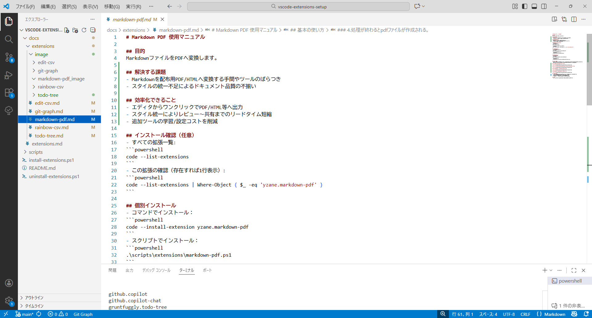
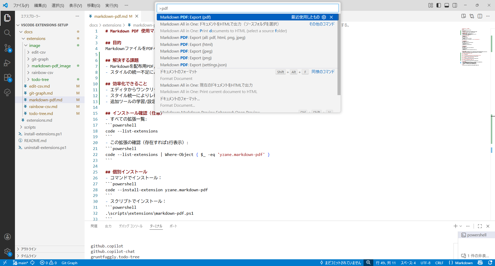
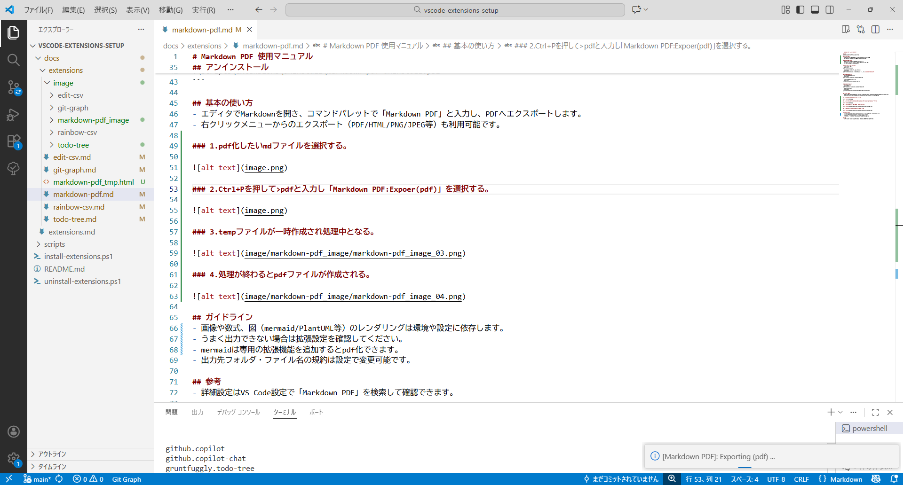
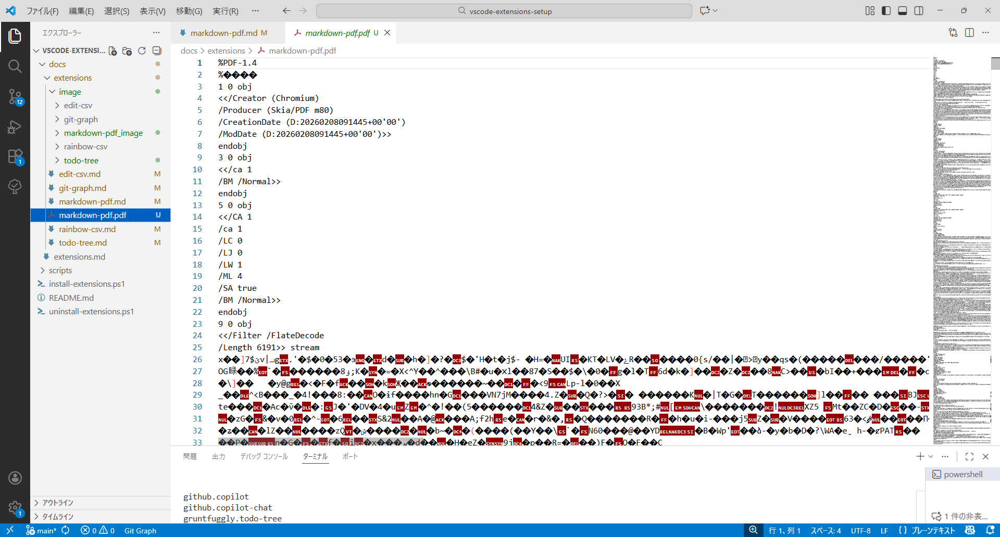

# Markdown PDF 使用マニュアル

## 目的
MarkdownファイルをPDFへ変換します。

## 解決する課題
- Markdownを配布用PDF/HTMLへ変換する手間やツールのばらつき
- スタイルの統一不足によるドキュメント品質の不揃い

## 効率化できること
- エディタからワンクリックでPDF/HTML等へ出力
- スタイル統一によりレビュー～共有までのリードタイム短縮
- 追加ツールの学習/設定コストを削減

## インストール確認（任意）
- すべての拡張一覧:
```powershell
code --list-extensions
```
- この拡張の確認（存在すれば1行表示）:
```powershell
code --list-extensions | Where-Object { $_ -eq 'yzane.markdown-pdf' }
```

## 個別インストール
- コマンドでインストール：
```powershell
code --install-extension yzane.markdown-pdf
```
- スクリプトでインストール：
```powershell
.\scripts\extensions\markdown-pdf.ps1
```

## アンインストール
- コマンドで削除：
```powershell
code --uninstall-extension yzane.markdown-pdf
```
- スクリプトで削除：
```powershell
.\scripts\extensions\uninstall\markdown-pdf-uninstall.ps1
```

## 基本の使い方
- エディタでMarkdownを開き、コマンドパレットで「Markdown PDF」と入力し、PDFへエクスポートします。
- 右クリックメニューからのエクスポート（PDF/HTML/PNG/JPEG等）も利用可能です。

### 1.pdf化したいmdファイルを選択する。



### 2.Ctrl+Pを押して>pdfと入力し「Markdown PDF:Expoer(pdf)」を選択する。



### 3.tempファイルが一時作成され処理中となる。



### 4.処理が終わるとpdfファイルが作成される。



## ガイドライン
- 画像や数式、図（mermaid/PlantUML等）のレンダリングは環境や設定に依存します。
- うまく出力できない場合は拡張設定を確認してください。
- mermaidは専用の拡張機能を追加するとpdf化できます。
- 出力先フォルダ・ファイル名の規約は設定で変更可能です。

## 参考
- 詳細設定はVS Code設定で「Markdown PDF」を検索して確認できます。
