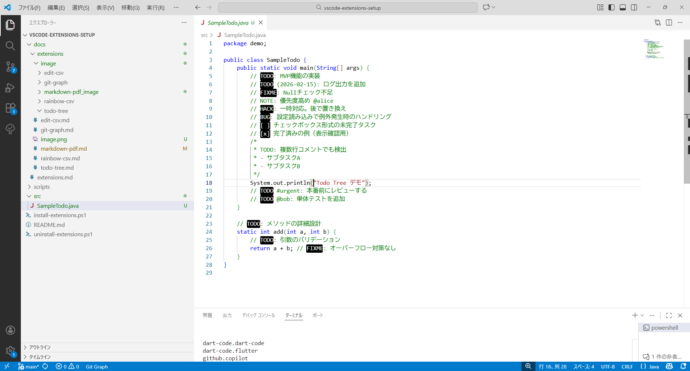
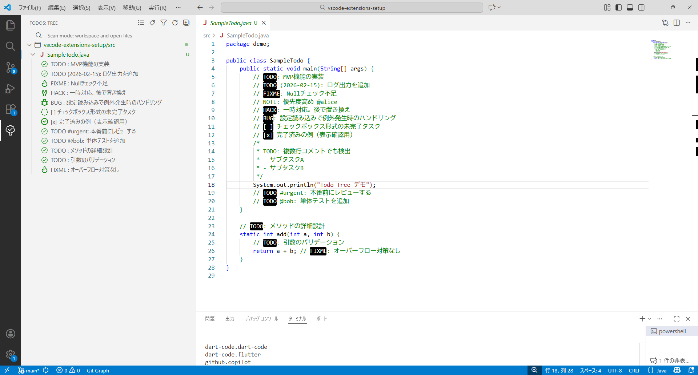

# Todo Tree 使用マニュアル

## 目的
コード中の`TODO`や`FIXME`などのタグを収集し、ツリー表示で管理します。

## 解決する課題
- コード中のTODO/FIXMEが散在して見落としやすい
- 優先度や担当ごとの整理が難しく進捗が不透明

## 効率化できること
- プロジェクト横断でタスク抽出・集約し一覧管理
- タグ/担当/優先度でフィルタ、該当箇所へ即ジャンプ
- チェック管理で進捗を可視化しレビューを円滑化

## インストール確認（任意）
- すべての拡張一覧:
```powershell
code --list-extensions
```
- この拡張の確認（存在すれば1行表示）:
```powershell
code --list-extensions | Where-Object { $_ -eq 'Gruntfuggly.todo-tree' }
```

## 個別インストール
- コマンドでインストール：
```powershell
code --install-extension Gruntfuggly.todo-tree
```
- スクリプトでインストール：
```powershell
.\scripts\extensions\todo-tree.ps1
```

## アンインストール
- コマンドで削除：
```powershell
code --uninstall-extension Gruntfuggly.todo-tree
```
- スクリプトで削除：
```powershell
.\scripts\extensions\uninstall\todo-tree-uninstall.ps1
```

## 基本の使い方
- サイドバーにTodo Treeビューが追加され、タグが一覧表示されます。
- 項目をクリックすると該当箇所へジャンプできます。

### 1.インストール後左側のメニューバーに木のマーク(Todo Tree)が追加されます。


### 2.プログラムに「TODO」「FIXME」「BUG」などのタグをコメントで記載します。



### 3.木のマーク(Todo Tree)をクリックすると特定のタグを入れた箇所のみ表示できます。




## ガイドライン
- タグの種類や検出パターンは設定でカスタマイズ可能です（例: `TODO`, `FIXME`, `BUG` など）。
- ワークスペースごとに設定を調整するとチームの規約に合わせて運用できます。

## 参考
- VS Code設定で「Todo Tree」を検索し、タグ・アイコン・除外パターンなどを調整することができます。
