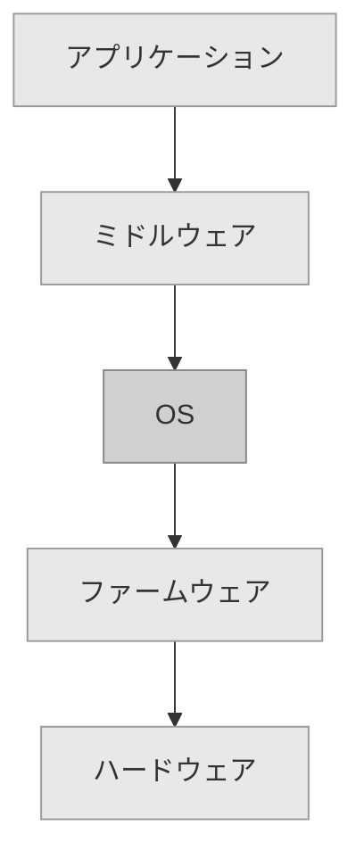
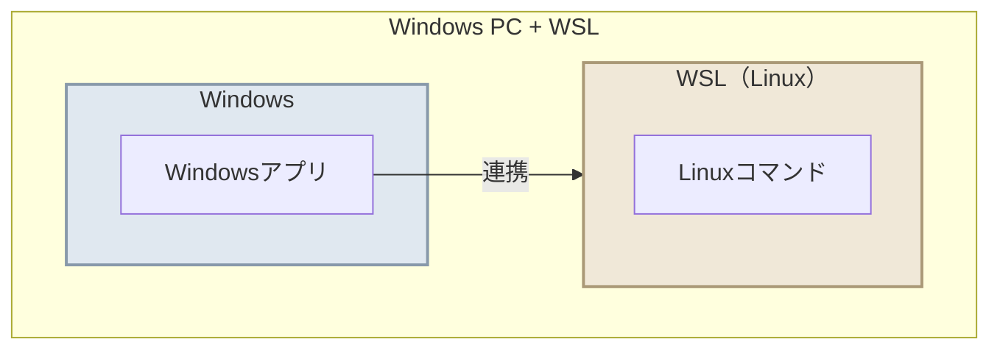
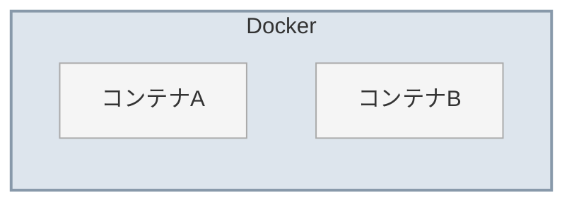
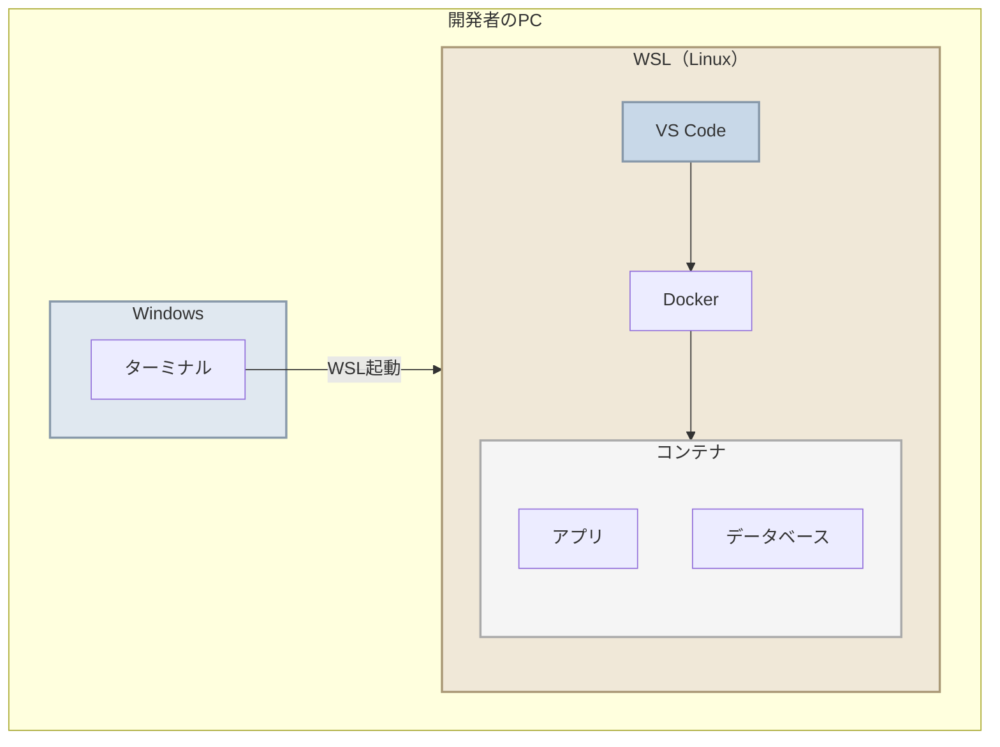
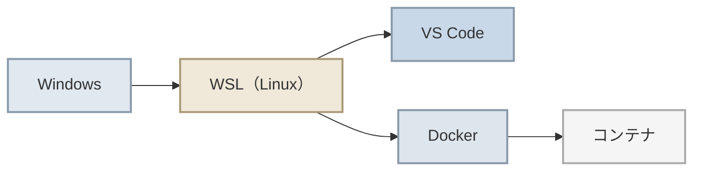
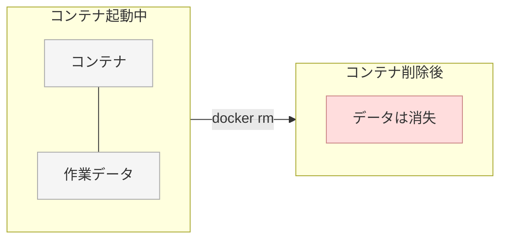
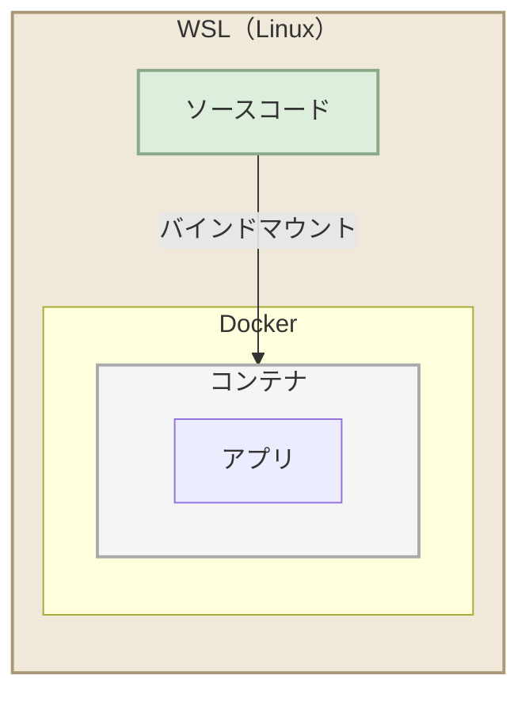
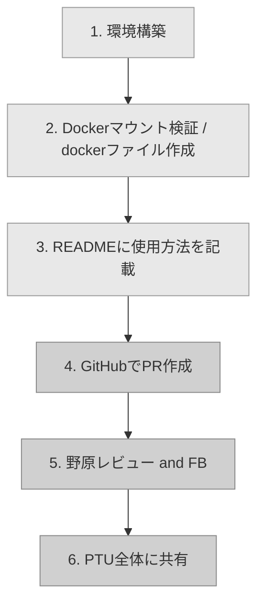

# 開発環境の概要（WSL + Docker）

このドキュメントでは、開発環境で使うWSLとDockerについて、PCの基本構造から順に説明します。

---

## 目次
- [PCの基本構造](#pcの基本構造)
- [WSLとは](#wslとは)
- [Dockerとは](#dockerとは)
- [なぜWSL + Dockerで開発するのか](#なぜwsl--dockerで開発するのか)
- [全体像まとめ](#全体像まとめ)
- [コンテナの揮発性について](#コンテナの揮発性について)
- [ワークフロー](#ワークフロー)

---

## PCの基本構造

普段使っているPCは、大きく分けて以下の5つの層で構成されています。

| 層 | 説明 | 例 |
|---|---|---|
| **アプリケーション** | ユーザーが直接使うソフト | VS Code、ブラウザ |
| **ミドルウェア** | アプリとOSの間で動く基盤ソフト | Docker、データベース |
| **OS** | ハードウェアを管理しソフトを動かす土台 | Windows、Linux |
| **ファームウェア** | PC起動時にハードウェアを初期化するソフト | BIOS、UEFI |
| **ハードウェア** | 物理的な部品 | CPU、メモリ、ディスク |

---

## WSLとは

**WSL（Windows Subsystem for Linux）** は、Windows上でLinuxを動かせる仕組みです。

通常、1台のPCでは1つのOSしか使えませんが、WSLを使うとWindows内にLinux環境が追加され、両方のOSを同時に使えるようになります。

---

## Dockerとは

**Docker** は、アプリの実行環境をまるごとパッケージにして、どのPCでも同じ環境を再現できるツールです。

「自分のPCでは動くけど他の人のPCでは動かない」という問題を解決します。

| 用語 | 説明 |
|---|---|
| **コンテナ** | アプリとその動作に必要なものをまとめた軽量な実行単位 |
| **イメージ** | コンテナの設計図。これを元にコンテナを作成する |

---

## なぜWSL + Dockerで開発するのか

### 開発環境の課題

| 課題 | 詳細 |
|---|---|
| 環境差異 | 人によってPCの設定が違い「自分のPCでは動く」問題が起きる |
| セットアップの手間 | 新メンバーが環境構築に何時間もかかる |
| 本番との差異 | 本番サーバーはLinuxだが開発PCはWindowsでOSが違う |

### WSL + Dockerによる解決

VS CodeはWSL内のLinuxに直接インストールして起動します。Windows側からリモート接続するのではなく、Linux環境の中でVS Codeを動かし、その上でDockerコンテナを立ち上げて開発を行います。

### メリット

| メリット | 説明 |
|---|---|
| **環境の統一** | 全員が同じDockerコンテナで開発するので環境差異がなくなる |
| **セットアップが簡単** | コマンド1つで開発環境が立ち上がる |
| **本番と同じOS** | WSL上のLinuxで開発するため本番サーバーとの差異が最小になる |
| **壊しても安心** | コンテナを消して作り直せば元通り。PC本体には影響しない |
| **複数プロジェクト対応** | プロジェクトごとに別のコンテナを使え依存関係が衝突しない |

---

## 全体像まとめ

> Windows上のWSL（Linux）にVS Codeをインストールし、Linux環境内で直接開発を行います。
> DockerもWSL内で動作し、コンテナ内でアプリやデータベースを実行します。

---

## コンテナの揮発性について

Dockerコンテナは**揮発性**（volatile）です。コンテナを停止・削除すると、コンテナ内で作成・変更したデータはすべて失われます。

### なぜ揮発性なのか

コンテナは「使い捨てできる実行環境」として設計されています。壊れたら削除して作り直すことで、常にクリーンな状態を保てます。これはメリットでもありますが、データの扱いには注意が必要です。

### データを永続化するには

コンテナ内のデータを残したい場合は、**ボリューム（Volume）** や **バインドマウント（Bind Mount）** を使って、WSL側のファイルシステムとコンテナ内を接続します。

| 方法 | 説明 |
|---|---|
| **ボリューム** | Docker が管理する専用の保存領域。コンテナを削除してもデータが残る |
| **バインドマウント** | WSL側の特定のフォルダをコンテナ内にそのまま共有する |

> ソースコードはWSL側に置き、バインドマウントでコンテナと共有します。
> これにより、コンテナを削除してもソースコードは失われません。

---

## ワークフロー

### スケジュール

| ステップ | 内容 | 期限 |
|---|---|---|
| 1 | WSL + Docker の環境構築 | 3/18(水)午前中いっぱい |
| 2 | Dockerマウント検証（dockerファイル作成） | 3/18(水)午前中いっぱい |
| 3 | READMEに使用方法を記載 | 3/18(水)午前中いっぱい |
| 4 | GitHubでPR作成 | **3/18(水)午前中いっぱい** |
| 5 | 野原レビュー＆フィードバック | 3/18(水) |
| 6 | PTU全体に共有して完了 | 3/18(水)以降 |
